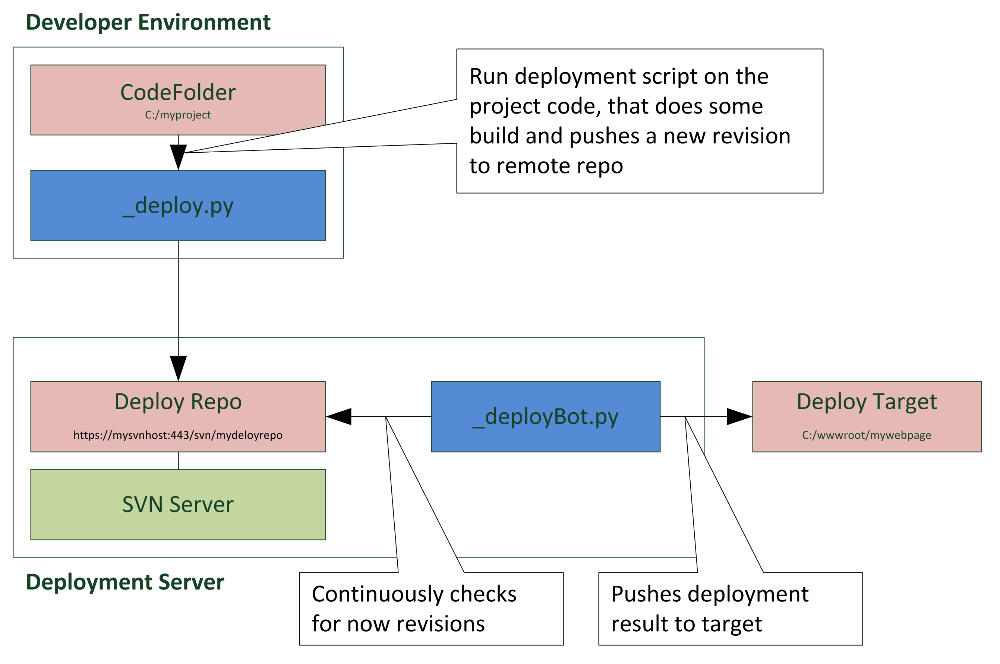

# simpleDeploy

## Required
- Python (tested on 3.8.5 (tags/v3.8.5:580fbb0, Jul 20 2020, 15:43:08) [MSC v.1926 32 bit (Intel)] on win32)
- TortoiseSVN installation available to be executed on commandline (extra checkmark on installation) -> https://tortoisesvn.net/index.de.html
- An SVN Server and repository, e.g. one simple way to setup one is VisualSVN -> https://www.visualsvn.com/

## The Idea
For now, a simple deployment script around an svn repository that stores the delivered content.

Their are two small scripts:
- _deploy.py - which i use inside my project code, to trigger the deploy (and "build")
- _deployBot.py - which is a looped script, that keeps running and monitors the remote repository for new commits

Serves me as a template for more complex build / deploy scripting, so may save you a day of scripting work ;)

